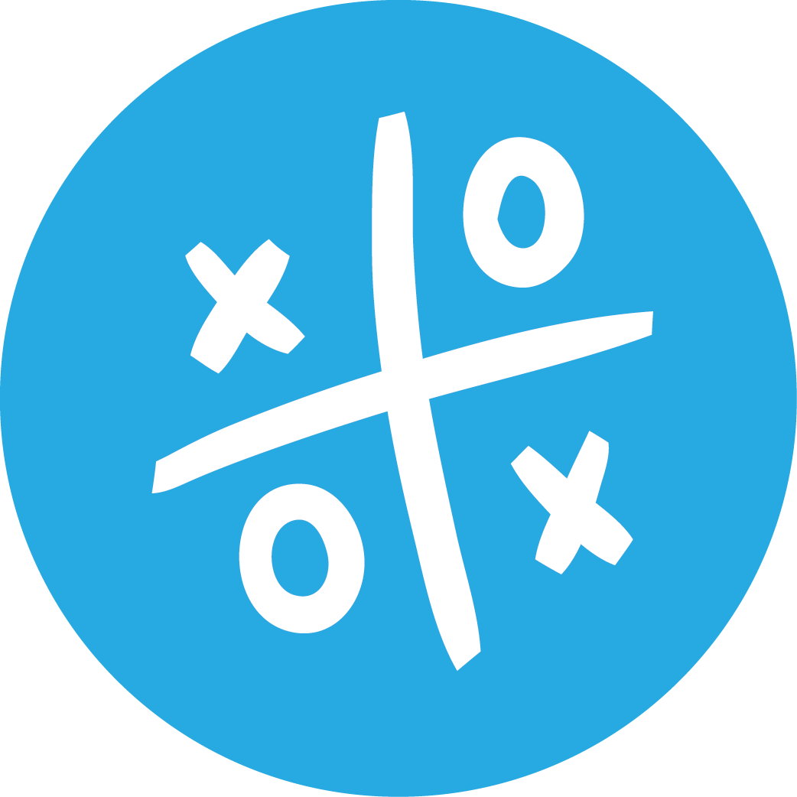

<p align="center">
  
</p>

<h1 align="center">Tik Tak Tok | لعبة XO</h1>

<p align="center">
  <strong>A modern, bilingual (English & Arabic) cross-platform desktop Tic-Tac-Toe game featuring local pass-and-play, LAN/Socket multiplayer, an interactive drawing canvas, and automated in-app patching.</strong>
</p>

<p align="center">
  <em>لعبة إكس-أو كلاسيكية حديثة وممتعة تدعم اللعب المحلي والشبكي واللغتين العربية والإنجليزية مع تحديثات تلقائية وتصميم تفاعلي.</em>
</p>

<p align="center">
  <a href="https://github.com/Mahfoud-Sa/tik-tak-to/releases/latest"></a>
  <a href="https://www.python.org/downloads/"></a>
  <a href="https://mahfoud-sa.github.io/XO_Game/"></a>
  <a href="#"></a>
  <a href="#"></a>
  <a href="#"></a>
</p>

<p align="center">
  <a href="https://mahfoud-sa.github.io/XO_Game/"><strong>🌐 Visit Official Website</strong></a> •
  <a href="https://github.com/Mahfoud-Sa/tik-tak-to/releases/latest"><strong>⬇️ Download Latest Release</strong></a> •
  <a href="#-key-features"><strong>✨ Features</strong></a> •
  <a href="#-architecture"><strong>🏗️ Architecture</strong></a> •
  <a href="#-getting-started"><strong>🚀 Getting Started</strong></a> •
  <a href="#-lan-multiplayer-guide"><strong>🎮 Multiplayer Guide</strong></a>
</p>

---

## 📖 Overview

**Tik Tak Tok (لعبة XO)** reimagines the classic Tic-Tac-Toe experience into a polished, robust desktop application. Built with **Python** and **Tkinter** following strict **MVC (Model-View-Controller)** principles, it delivers seamless gameplay whether you are sharing a keyboard locally, dueling a friend across your local Wi-Fi / LAN, or exploring creative doodling on the pre-game canvas.

---

## ✨ Key Features

### 🎮 Gameplay Modes
- **Local Pass-and-Play (2 Players):** Play side-by-side with automatic win-detection, turn switches, and live scorekeeping (X Wins / O Wins).
- **LAN & Socket Multiplayer:** Connect with friends on the same local network using lightweight, asynchronous TCP sockets.
  - One player hosts the server with a single click.
  - The other player joins by entering the host's IP address.
  - Real-time connection status light indicator directly on the game board.

### 🌍 First-Class Bilingual Experience (العربية / English)
- **Instant Language Dropdown:** Switch languages anytime from the main menu without restarting.
- **True Layout Directionality (Bi-directional RTL / LTR):** Switching to Arabic mirrors the scoreboard, dialog layouts, and widget packing to proper Right-to-Left orientation while preserving the spatial 3x3 game board coordinates.
- **Persistent Preferences:** Your chosen language is remembered across sessions.

### 🎨 Creative Canvas & Dynamic Themes
- **Interactive Doodling Canvas:** Relax between rounds with a freeform drawing canvas featuring customizable brush thickness, radius, and vibrant color palettes.
- **Multiple Color Themes:** Easily toggle between visual background and grid color schemes.

### 🔄 In-App Patcher & Automated Updates
- **Update Manifest Integration:** Non-blocking background checks against public update manifests (`docs/updates/version.json`) and GitHub releases.
- **Safe Hand-off Patcher:** Downloads zip archives in chunks with SHA-256 checksum verification, then seamlessly hands off file replacement to an external script upon app shutdown.
- **Mandatory Update Gate:** Protects network multiplayer compatibility across version jumps while keeping local games always accessible.

---

## 🖼️ Preview

<p align="center">
  
  
</p>

> 🌐 Check out the interactive showcase and release changelogs at [mahfoud-sa.github.io/XO_Game](https://mahfoud-sa.github.io/XO_Game/).

---

## 🏗️ Architecture

The project is structured according to clean software engineering practices, separating concerns across modular packages:

```
XO_Game/
├── game/                      # Desktop Application Source Code
│   ├── main.py                # Application entrypoint & dependency wire-up
│   ├── config.py              # UI constants, board dimensions, theme definitions
│   ├── network_config.py      # Network socket constants & status colors
│   ├── models/                # Business logic & game state
│   │   └── game_state.py      # Board representation, winning line calculation, scores
│   ├── views/                 # Presentation layer (Tkinter GUI)
│   │   ├── game_view.py       # Board rendering, drawing canvas, animations
│   │   └── widgets/           # Modular dialogs (Multiplayer, Updates, Help, Menus)
│   ├── controllers/           # Application coordination & event binding
│   │   ├── game_controller.py         # Handles local move flow and game events
│   │   └── network_game_controller.py # Bridges socket messages to game state
│   ├── network/               # Peer-to-peer networking engine
│   │   ├── server.py          # Host socket listener & event loop
│   │   └── client.py          # Guest socket client & connection handler
│   └── utils/                 # Supporting utilities
│       ├── i18n.py            # Bilingual dictionary, RTL helpers & preferences store
│       └── updater.py         # Update manifest fetcher, downloader & patch runner
├── docs/                      # GitHub Pages documentation & update server
│   ├── updates/version.json   # Public update manifest used by the in-app patcher
│   └── index.html             # Product landing page & release history
├── tests/                     # Automated test suite (47 tests)
│   ├── test_i18n.py                   # Internationalization & translation tests
│   ├── test_layout_directionality.py  # RTL / LTR layout mirroring tests
│   ├── test_manifest.py               # Manifest parsing & semantic validation
│   ├── test_download_engine.py        # Chunked download & SHA-256 checks
│   ├── test_batch_patcher.py          # Windows batch handoff script tests
│   └── test_multiplayer_gate.py       # Version gate verification tests
└── scripts/                   # Release automation & manifest generators
```

---

## 🚀 Getting Started

### Option 1: Download Pre-built Executable (Recommended for Players)

No Python installation required!

1. Head over to the **[Latest GitHub Releases](https://github.com/Mahfoud-Sa/tik-tak-to/releases/latest)**.
2. Download `Tik_Tak_Tok-v3.0.2-windows-x64.zip`.
3. Extract the archive and launch `Tik Tak Tok.exe`.

---

### Option 2: Run from Source (Developers)

#### Prerequisites
- **Python 3.10+**
- Standard Python libraries (`tkinter`, `socket`, `threading`, `urllib`, `json`, `dataclasses`)
- *Note for Linux users:* Ensure `python3-tk` is installed (`sudo apt install python3-tk`).

#### Setup & Execution

1. **Clone the repository:**
   ```bash
   git clone https://github.com/Mahfoud-Sa/tik-tak-to.git
   cd tik-tak-to
   ```

2. **Create and activate a virtual environment:**
   ```bash
   # Windows (PowerShell)
   python -m venv .venv
   .venv\Scripts\Activate.ps1

   # macOS / Linux
   python3 -m venv .venv
   source .venv/bin/activate
   ```

3. **Install build dependencies (optional, for packaging):**
   ```bash
   pip install -r requirements.txt
   ```

4. **Launch the game:**
   ```bash
   python game/main.py
   ```

---

## 🎮 LAN Multiplayer Guide

Playing with a friend over the same Wi-Fi / Local Area Network is simple:

### Step 1: Host a Game (Player 1)
1. Launch **Tik Tak Tok**.
2. Click **Multiplayer** (متعدد اللاعبين) and choose **Host Game** (استضافة لعبة).
3. The dialog will display your machine's **Local IP Address** (e.g., `192.168.1.15`) and **Port** (default: `5555`).
4. Click **Start Hosting** and share your IP address with Player 2.

### Step 2: Join a Game (Player 2)
1. Launch **Tik Tak Tok** on another computer connected to the same network.
2. Click **Multiplayer** (متعدد اللاعبين) and select **Join Game** (الانضمام إلى لعبة).
3. Enter Player 1's IP address and port number.
4. Click **Connect**.
5. Once connected, the green status indicator will light up on both boards, and the duel begins!

---

## 🧪 Testing & Quality Assurance

The codebase maintains a robust test suite covering internationalization, layout directionality, socket multiplayer gating, and the update engine.

Run all tests from the repository root:

```bash
python -m unittest discover tests
```

Output:
```text
...............................................
----------------------------------------------------------------------
Ran 47 tests in 0.48s

OK
```

---

## 📦 Building Standalone Binaries

To build a standalone Windows executable using PyInstaller:

```bash
# Build standalone directory bundle
python scripts/build_release.py --version 3.0.2

# Or directly with pyinstaller
pyinstaller game/XO_Game.spec
```

The output binary will be generated under `dist/`.

---

## 🤝 Contributing & Feedback

Contributions, feature requests, and bug reports are warmly welcome!

- 🐛 **Found a bug?** Open an issue on the [GitHub Issues page](https://github.com/Mahfoud-Sa/tik-tak-to/issues).
- 💡 **Have a feature idea?** Start a discussion or submit a Pull Request.
- ⭐ **Enjoying the game?** Please star this repository on GitHub!

---

## 👨‍💻 Author

**Eng. Mahfoud Mohamed Bensebbah (المهندس محفوظ محمد بن سباح)**  
- 📧 **Email:** binsabbah2013@gmail.com  
- 💬 **WhatsApp:** [+967 770 266 408](https://wa.me/967770266408)  
- 🐙 **GitHub:** [@Mahfoud-Sa](https://github.com/Mahfoud-Sa)

---

## 📄 License

This project is open-source and released for educational and recreational use. See individual file headers and [docs/LICENSE.txt](docs/LICENSE.txt) for website template third-party attributions.

<p align="center">
  Made with ❤️ by Eng. Mahfoud Mohammed Binsabbah • 2020 - 2026
</p>
